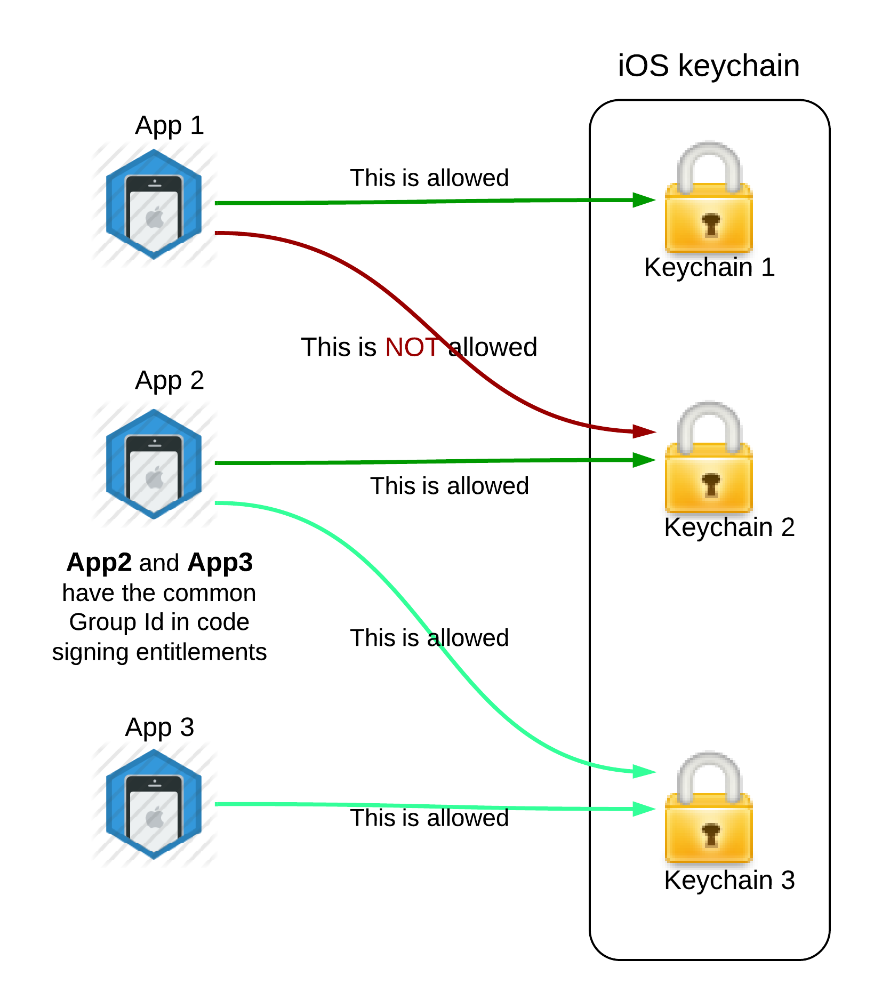
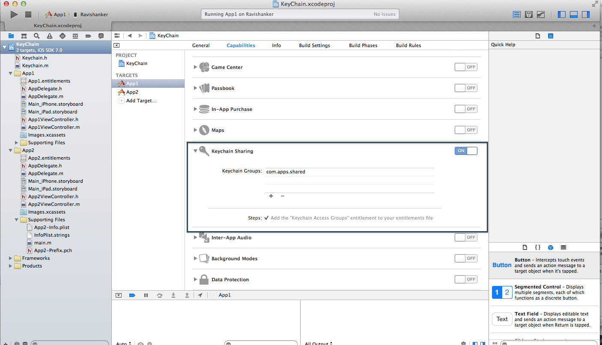
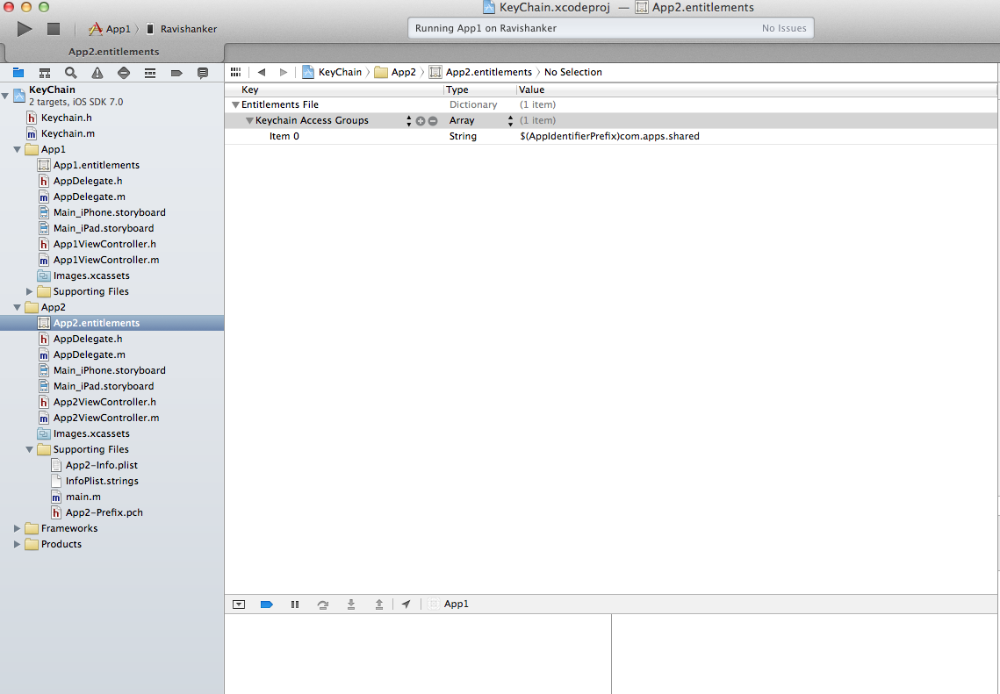

# KeyChain_Sample
Sample Key Chain Program
How KeyChain Works 


To enable the Keychain Share in App do as shown In Image


This will create entitlements file in the project as shown in the below image.


Add the <B>Security.Framework</B>

Copy the VROKeyChain.h & VROKeyChain.m file  to Your Bundle


##Usage

Example 

```
//////////////////* KEYCHAIN METHODS*/////////////////

-(void)insertIntoKeyChain{
NSString *key =@"YOUR_KEY";
NSData * value = [@"YOUR_DATA" dataUsingEncoding:NSUTF8StringEncoding];

if([keychain insert:key :value])
{
NSLog(@"Successfully added data");
}
else
NSLog(@"Failed to  add data");
}
-(void)updateKeyChain{
NSString *key =@"YOUR_KEY";
NSData * value = [@"NEW_VALUE" dataUsingEncoding:NSUTF8StringEncoding];

if([keychain update:key :value])
{
NSLog(@"Successfully updated data");
}
else
NSLog(@"Failed to  add data");
}
-(void)removeFromKeyChain{
NSString *key =@"YOUR_KEY";
if([keychain remove:key])
{
NSLog(@"Successfully removed data");
}
else
{
NSLog(@"Unable to remove data");
}
}
-(void)findFromKeychain{
NSString *key= @"YOUR_KEY";
NSData * data =[keychain find:key];
if(data == nil)
{
NSLog(@"Keychain data not found");
}
else
{
NSLog(@"Data is =%@",[[NSString alloc] initWithData:data encoding:NSUTF8StringEncoding]);
}
}
```


## Author

rahul-apple, rahulthazhuthala@gmail.com
- [Facebook][] Rahul Ramachandra
- [Google][] Rahul Ramachandra

[Google]:https://plus.google.com/+RahulR-apple
[Facebook]:https://www.facebook.com/hijaz3710

## License
available under the MIT license. See the LICENSE file for more info.
